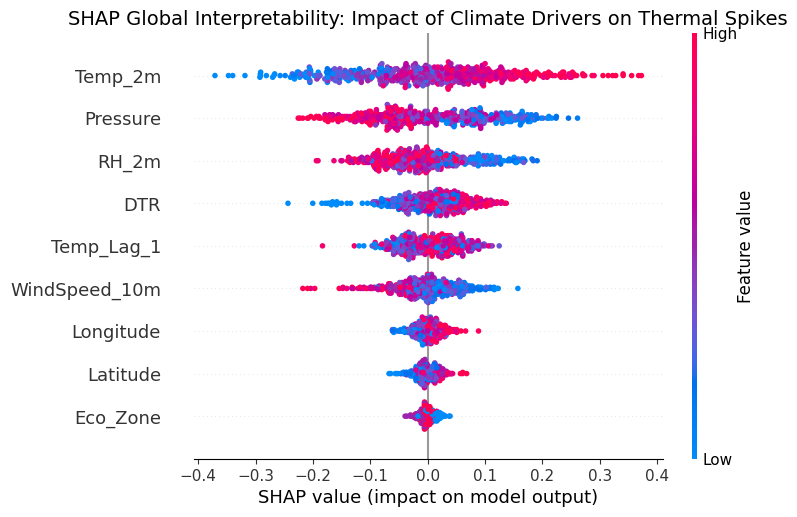
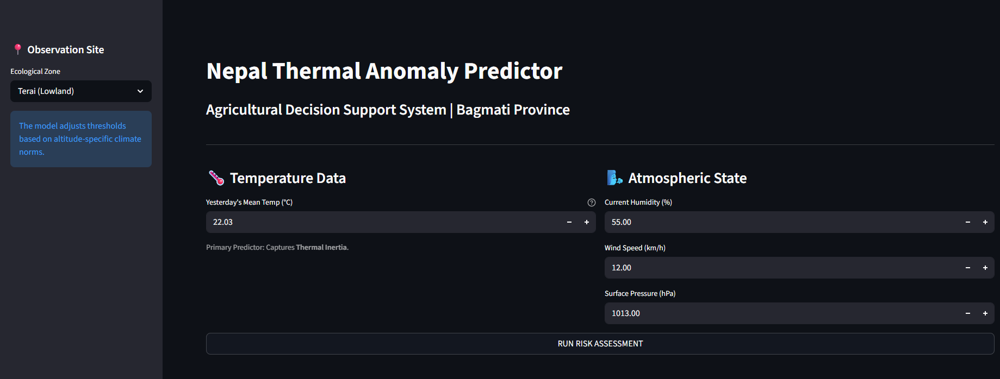

# nepal-thermal-ai

## 🧠 Model Download
Because the Random Forest model is 211 MB (exceeding GitHub's standard upload limit), 
it is hosted in the **Releases** section of this repository.
👉 **[Download nepal_thermal_model.pkl here](https://github.com/himansuhamal99/nepal-thermal-ai/releases/download/v1.0.0/nepal_thermal_model.pkl)**

*Please download this file and place it in the project folder to run the Streamlit app.*

Early-Warning System for Thermal Anomalies in Bagmati Province, Nepal using Random Forest and SHAP

## 📊 Model Insights
To ensure the AI is "Explainable," I utilized SHAP values to identify the primary climate drivers for Bagmati Province.

*Figure 1: SHAP analysis showing the impact of Yesterday's Temperature and Humidity.*

## 💻 System Interface
The following dashboard allows users to input localized data for Terai, Hills, and Mountain zones.

